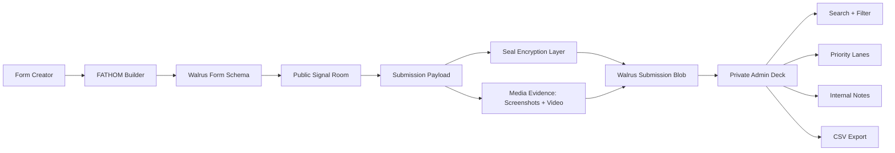
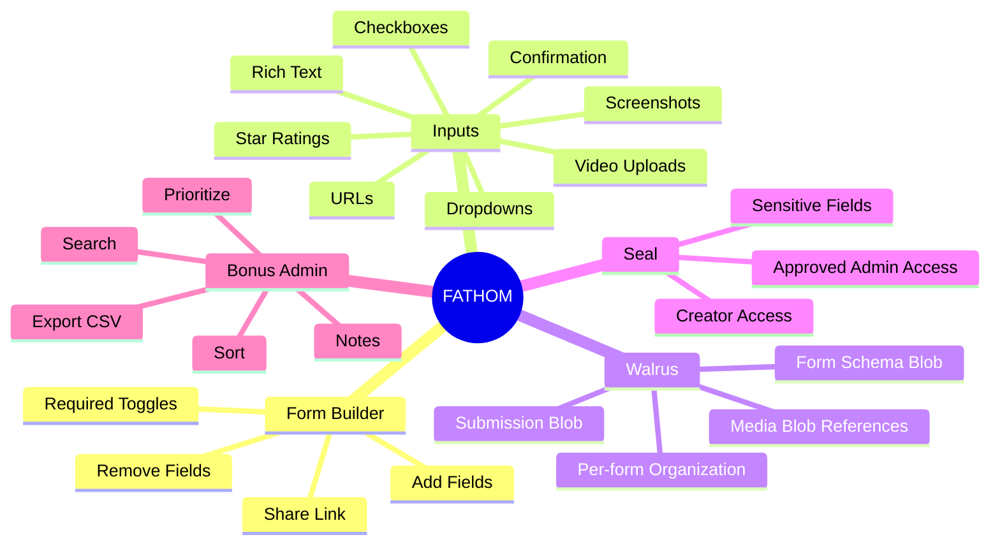
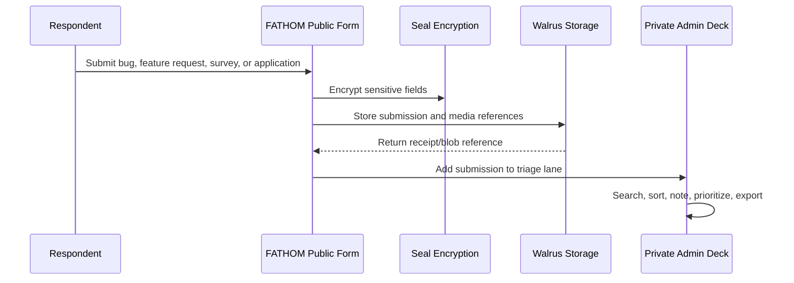

# FATHOM


**FATHOM is a Walrus-native feedback operating system for Sessions, bug reports, feature requests, surveys, and applications.**

It is not a normal form builder. FATHOM turns every form into a shareable Walrus signal room, every sensitive answer into Seal-protected data, and every submission into a private admin workflow teams can actually act on.

Built for **Walrus Sessions Round 2**.

Designed by [Dexar](https://x.com/dexarxbt).

---

## Repo Description

**Walrus-native feedback OS for encrypted forms, media-rich submissions, and private admin triage with Seal access control.**

---

## The Idea

Walrus Sessions needs a tool to run future feedback loops. FATHOM is built for that exact job:

- Creators can spin up forms for bug reports, feature requests, surveys, applications, and reviewer workflows.
- Respondents can submit rich text, dropdown answers, checkboxes, ratings, screenshots, videos, URLs, and confirmation locks.
- Submissions are organized per form and designed to be stored on Walrus.
- Sensitive fields are marked for Seal encryption so only creators and approved admins can read them.
- Teams get a private admin deck to sort, search, prioritize, annotate, and export the data.

FATHOM treats feedback like operational signal, not passive form data.

---

## Visual Identity

FATHOM uses the included Walgo/Walrus visual DNA:

<p align="center">
  
</p>

The interface is built around:

- pixel typography
- glitch motion
- scanline overlays
- terminal-style panels
- Walrus blob metaphors
- Seal privacy states
- sharp Web3 mini-site energy
- dark/light adaptive theme switching

---

## Product Map



---

## Core Features

| Area | What FATHOM Includes |
|---|---|
| Form creation | Add/remove fields, edit labels, toggle required status |
| Supported inputs | Rich text, dropdowns, checkboxes, star ratings, screenshots, video uploads, URLs, confirmation checkboxes |
| Walrus-native model | Form schemas and submissions are represented as Walrus-stored objects |
| Seal privacy | Sensitive fields expose Seal encryption states |
| Share flow | Public form link preview for every created signal room |
| Public form | Responsive submission experience with progress visualization |
| Admin dashboard | Private triage deck with lanes, stats, search, sorting, notes, and export |
| Export | CSV export for submissions and review workflows |
| Theme system | Animated dark/light theme switcher |
| Motion | Glitch text, scanlines, floating nodes, animated grids, hover sweeps, magnetic buttons |

---

## Hackathon Brief Coverage



---

## Experience Screens

### 1. Signal Deck

The landing page introduces FATHOM as a Walrus feedback OS, with the Walgo identity, live protocol states, and animated system preview.

### 2. Builder

Creators compose a form from field blocks:

```text
Rich Text  -> sensitive report body
Dropdown   -> submission category
Checkboxes -> affected surfaces
Rating     -> severity or quality score
Screenshot -> visual proof
Video      -> walkthrough proof
URL        -> reference links
Confirm    -> explicit storage consent
```

### 3. Public Form

Respondents submit one high-signal report with progress feedback, proof media, and visible Seal/Walrus states.

### 4. Admin Deck

Teams triage submissions like tasks:

```text
New      -> unreviewed incoming signals
Review   -> needs context or owner review
Action   -> ready to fix, prioritize, or export
```

---

## Admin Workflow



---

## Demo Script

Use this flow for a sub-3-minute video:

1. Open the landing page and introduce FATHOM as a Walrus-native feedback OS.
2. Go to the builder and add a new field.
3. Toggle `Required` and `Seal encrypted` on a sensitive field.
4. Publish the form and open the public form view.
5. Submit a test report with rating, category, URL, and proof media.
6. Show the generated submission entering the admin deck.
7. Search/filter the submission, explain priority lanes, show internal notes.
8. Export CSV.
9. Close with the Walrus/Seal model: form schema, submissions, media, and privacy.

---

## Local Usage

This project is intentionally simple: one HTML file plus local assets.

```bash
git clone <your-repo-url>
cd <your-repo>
```

Open:

```text
index.html
```

No build step required.

---

## Deploying

FATHOM is a static app and can be deployed as a single-page site.

Suggested hackathon deployment path:

1. Commit `index.html`.
2. Commit the `assets/` folder.
3. Deploy the static site to Walrus Mainnet through your preferred Walgo/Walrus flow.
4. Host the demo video on Walrus.
5. Submit the public repo, one-pager, demo video, and one test submission.

---

## File Structure

```text
.
├── index.html
├── README.md
└── assets
    ├── walgo-header.jpg
    └── walgo-logo.jpg
```

---

## Why It Can Win

FATHOM is built around the actual judging surface:

- It does not look like a generic SaaS form builder.
- It shows Walrus and Seal as product primitives, not afterthoughts.
- It includes all required field types.
- It includes the bonus admin dashboard.
- It is easy to demo in under three minutes.
- It has a memorable identity that fits the Walgo/Walrus ecosystem.

---

## Credits

Built by [Dexar](https://x.com/dexarxbt) for Walrus Sessions Round 2.

Walgo/Walrus visual assets are used as part of the hackathon product identity.
