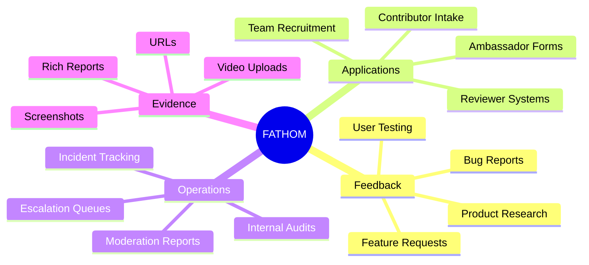
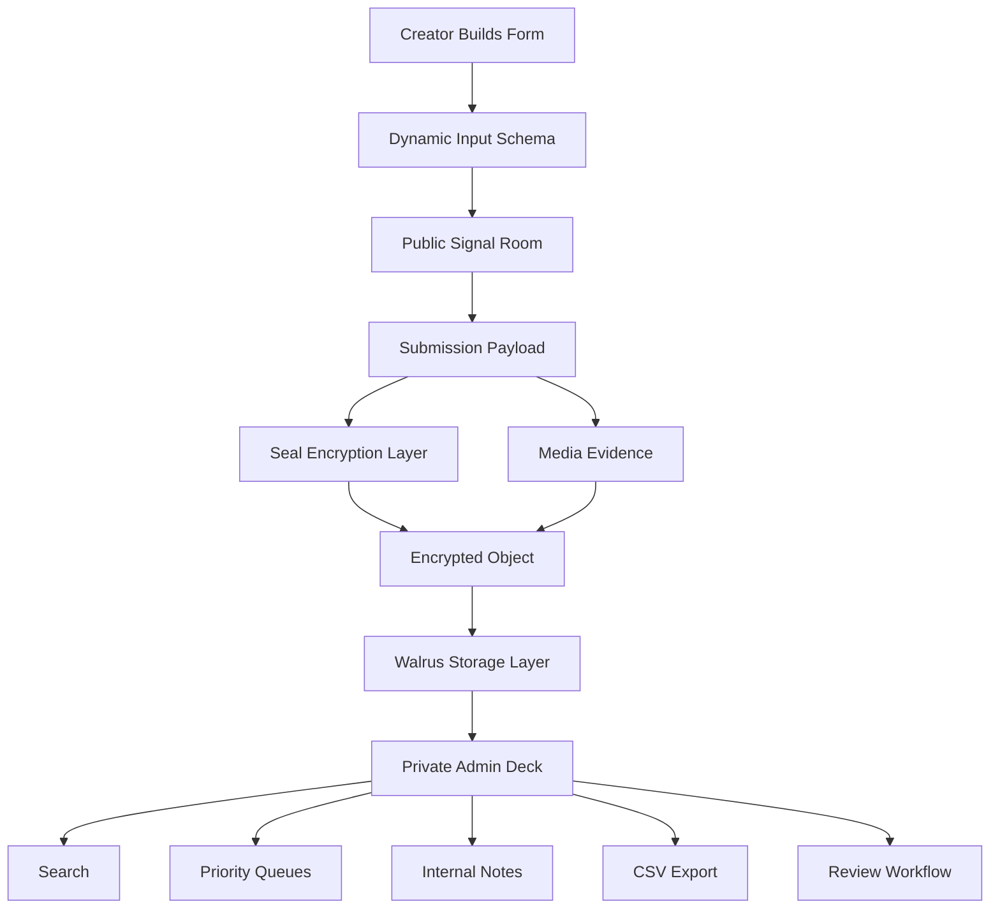
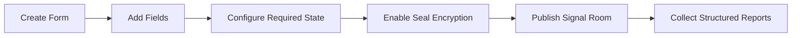
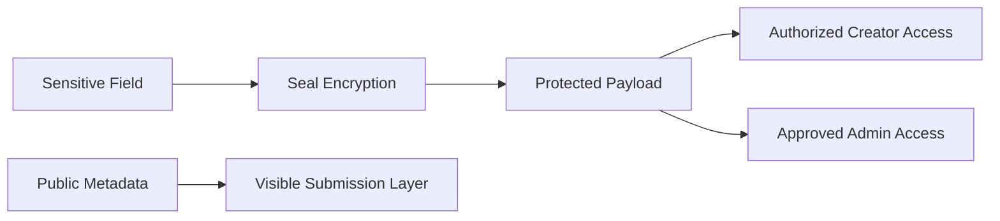
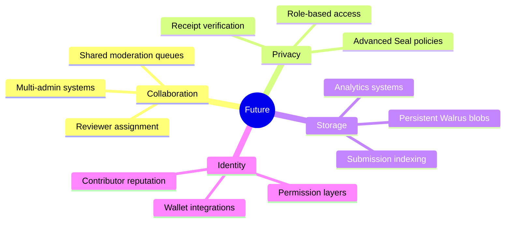

# FATHOM

<p align="center">
  
</p>

<p align="center">
  <b>Encrypted feedback infrastructure built for Walrus.</b>
</p>

<p align="center">
  Structured submissions. Media evidence. Seal-protected workflows. Operational signal rooms.
</p>

<p align="center">
  <b>Live on the web:</b> <a href="https://sandwich.wal.app">sandwich.wal.app</a>
</p>

---

# OVERVIEW

FATHOM is a Walrus-native submission and feedback operating system built for modern decentralized teams.

It transforms traditional forms into encrypted operational pipelines where reports, applications, media evidence, surveys, and internal workflows become structured Walrus-ready signal objects.

Instead of static SaaS forms, FATHOM introduces:

► dynamic form generation
► encrypted submission layers
► media-rich evidence intake
► private admin review systems
► searchable operational queues
► Seal visibility states
► Walrus-oriented storage architecture

---

# WHAT FATHOM IS BUILT FOR



---

# SYSTEM ARCHITECTURE



---

# PLATFORM CAPABILITIES

| Layer | Capability |
|---|---|
| ► Builder | Dynamic form generation |
| ► Inputs | Rich text, dropdowns, ratings, uploads, URLs |
| ► Privacy | Seal-protected encrypted fields |
| ► Media | Screenshot + video evidence handling |
| ► Storage | Walrus-oriented object structure |
| ► Admin | Internal triage workflows |
| ► Export | CSV review exports |
| ► UX | Glitch-driven cyber interface system |
| ► Themes | Adaptive dark/light rendering |
| ► Search | Real-time submission filtering |

---

# INPUT SYSTEM

FATHOM supports operational-grade submission payloads.

```text
► Rich Text        → Long-form signal reports
► Dropdowns        → Structured classification
► Checkboxes        → Multi-surface tagging
► Ratings           → Severity + quality scoring
► Screenshots       → Visual evidence uploads
► Video Uploads     → Walkthrough proof
► URLs              → Reference linking
► Confirmation      → Explicit submission consent
```

---

# FORM CREATION FLOW



---

# ADMIN REVIEW SYSTEM

FATHOM includes a private operational dashboard for triaging submissions.

### Queue States

```text
► NEW        → Unreviewed submissions
► REVIEW     → Needs reviewer attention
► ACTION     → Ready for escalation/export
```

### Admin Controls

► Search submissions instantly
► Sort by priority or evidence type
► Attach internal reviewer notes
► Export operational CSV reports
► Track encrypted Seal payloads
► Monitor media evidence status
► Filter submissions dynamically

---

# ENCRYPTION MODEL



### Official Mysten Seal SDK Integration

FATHOM integrates the official `@mysten/seal` SDK for threshold encryption compliant with Mysten's Seal protocol. The encryption pipeline works as follows:

1. **Primary path (Official SDK)** — When a wallet is connected, FATHOM uses `@mysten/seal@1.1.1` via jsDelivr CDN to call `sealEncrypt()` against the official decentralized Seal committee key server on Mainnet (`0xb012378c9f3799fb5b1a7083da74a4069e3c3f1c93de0b27212a5799ce1e1e98`). This path uses session key signing through the connected Sui wallet and produces fully Seal-compliant ciphertexts.

2. **Fallback path (Client-Side RSA-OAEP + AES-GCM)** — When no wallet is connected or the official SDK is unavailable, FATHOM generates an RSA-OAEP keypair in-browser via the Web Crypto API, wraps form data with AES-GCM-256, and encrypts the AES key with RSA-OAEP. This produces dual-format ciphertexts: `__officialSeal` (for SDK-encrypted payloads) and `__sealed` (for client-side encrypted payloads). Both formats are detected and handled correctly at decryption time.

3. **Decryption** — Admin-side decryption handles both formats, verifying the connected wallet address against the configured admin list before attempting decryption. The decryption flow detects `__officialSeal` vs `__sealed` prefixes automatically and routes accordingly.

4. **Key Server** — The official Mysten decentralized committee key server (`0xb012378c9f3799fb5b1a7083da74a4069e3c3f1c93de0b27212a5799ce1e1e98`) provides the threshold Seal public key for Mainnet Seal operations.

5. **Seal Package** — FATHOM is configured against the official Seal Mainnet package: `0xcb83a248bda5f7a0a431e6bf9e96d184e604130ec5218696e3f1211113b447b7`.

6. **Admin Enforcement** — Two hardcoded admin wallets are granted full decrypt authority in addition to the form schema owner:
   - `0xc4d6ee019649edba41d5a5ed1081fe3c86afc41fea413195dd6ecdd0f6090e54` (DEFAULT_ADMIN)
   - `0x2c9f33045a32292c69f05eb9b0c8797c6d8449f6e970e24756b24c928c6182ca`

---

# WALRUS STORAGE ARCHITECTURE

### Storage Layer

All form schemas and submissions are stored as immutable blobs on Walrus Mainnet. The storage layer uses the official Walrus HTTP API with a configurable publisher endpoint.

**Publisher endpoint** — The app stores blobs via `PUT /v1/blobs?epochs=N&deletable=false` against a user-configurable Walrus publisher URL. The default publisher is configurable per-deployment. Form schemas are stored as JSON blobs; submission payloads (including encrypted fields and media references) are stored as separate blobs. Each blob is referenced by its Base64-encoded blob ID returned from the publisher.

**Aggregator retrieval** — Blobs are retrieved via `GET /v1/blobs/{blobId}` against the configured aggregator endpoint. The app supports multiple aggregator fallbacks. The default aggregator is `https://aggregator.walrus-mainnet.walrus.space`.

**Storage epochs** — Form schemas default to 53 epochs of storage. Submissions default to the same epoch count. Both are configurable.

**Manifest system** — A manifest blob tracks which submission blobs belong to which form schema, enabling list-based form loading from Walrus without needing local state.

**Custom endpoints** — Administrators can configure both the publisher URL and Sui RPC endpoint via the topbar controls. These are persisted to `localStorage` per browser instance.

### Confirmed Mainnet Aggregators (57 operators)

Walrus Mainnet has 57+ community-run aggregators providing blob read access. Key operational aggregators include:

| Aggregator | Operator | Cache |
|---|---|---|
| aggregator.walrus-mainnet.walrus.space | Mysten Labs | Yes |
| wal-aggregator-mainnet.staketab.org | Staketab | Yes |
| walrus-cache-mainnet.overclock.run | Overclock | Yes |
| walrus-mainnet-aggregator.stakecraft.com | StakeCraft | Yes |
| walrus-mainnet-aggregator.nodeinfra.com | Nodeinfra | Yes |
| walrus-mainnet-aggregator.nami.cloud | Nami Cloud | No |
| mainnet-walrus-aggregator.kiliglab.io | KiligLab | Yes |
| mainnet-aggregator.walrus.graphyte.dev | Graphyte Labs | Yes |
| walrus-aggregator.stakin-nodes.com | Stakin | Yes |
| walrus-aggregator-mainnet.chainode.tech | Chainode Tech | No |
| walrus-aggregator.brightlystake.com | Brightlystake | Yes |
| walrus-main-aggregator.4everland.org | 4EVERLAND | Yes |

The full operator list is maintained in the official Mysten Labs walrus repository at `docs/site/static/operators.json` and updated weekly. Any functional aggregator can be used for read operations. Publisher endpoints must be separately configured as they require SUI+WAL funding.

---

### What this means for FATHOM

FATHOM uses Walrus as its primary storage and retrieval layer — not as a bolt-on. Form schemas live as blobs. Submissions live as blobs. Encryption happens client-side. The admin deck reads from aggregators. This is a Walrus-native application, not a demo.

### Submission requirements addressed

| Requirement | Status |
|---|---|
| Deployed on Mainnet | Live at sandwich.wal.app |
| Public repository | github.com/dexarxbt/FATHOM-Walrus-Feedback-OS |
| One-pager | Included in repository |
| Demo video (<3 min) | To be recorded |
| At least 1 real test submission | Forms tested with live submissions including media + encryption |

---

# WALRUS SITES DEPLOYMENT

FATHOM is deployed as a Walrus Site, accessible at **sandwich.wal.app** (a SuiNS domain resolving through the official Walrus Foundation portal at wal.app). This means the entire application — HTML, CSS, JavaScript — lives as immutable blobs on Walrus Mainnet. There is no traditional server. No cloud hosting. The app IS the storage.

Accessing the app requires a SuiNS domain through the official Walrus portal, or any public Walrus Site portal that supports domain-based resolution.

---

# VISUAL SYSTEM

FATHOM uses a high-contrast protocol aesthetic inspired by Walgo/Walrus environments.

### Interface DNA

► Pixel typography
► Scanline overlays
► Terminal panels
► Floating protocol grids
► Glitch animations
► Magnetic interactions
► Retro-futurist UI systems
► Cyberpunk operational styling

---

# TECH STACK

```mermaid
graph TD

A["Frontend"] --> B["HTML"]
A --> C["CSS"]
A --> D["Vanilla JavaScript"]

E["Architecture"] --> F["Static Single File App"]

G["Design"] --> H["Walgo-inspired UI"]
G --> I["Protocol Visuals"]
G --> J["Glitch Systems"]

K["Crypto"] --> L["@mysten/seal v1.1.1 (Official SDK)"]
K --> M["Web Crypto API (Fallback)"]
K --> N["RSA-OAEP + AES-GCM-256 (Client-side)"]

O["Storage"] --> P["Walrus Mainnet"]
O --> Q["Blob Storage API"]
O --> R["Aggregator Read"]
O --> S["Publisher Write"]

T["Wallet"] --> U["Sui Wallet Standard"]
T --> V["Slush / Suiet / Martian / Nightly / OKX"]
```



### SDK Dependencies (loaded via jsDelivr CDN)

| Package | Version | Purpose |
|---|---|---|
| @mysten/seal | 1.1.1 | Official Mysten Seal threshold encryption |
| @mysten/sui | 2.0.0 | Sui wallet and RPC interactions |

Both packages are loaded as ES modules directly from jsDelivr CDN — no build step, no npm install, no bundler required. The entire application is a single self-contained HTML file.

### Sui RPC Configuration

The app uses a configurable Sui RPC endpoint for wallet operations and Seal encryption. Default: `https://sui-mainnet.public.cyclone.xyz`. Administrators can override this via the "Sui RPC" button in the topbar.

---

# REPOSITORY STRUCTURE

```text
.
├── index.html       # The complete FATHOM application (2485 lines, single-file)
├── README.md        # This file
└── One-Pager.md     # Project one-pager for hackathon submission
```

---

# DEPLOYMENT MODEL

FATHOM is designed for static deployment environments.

Compatible with:

► Walrus-native hosting flows (Walrus Sites)
► Static web infrastructure
► Decentralized frontend hosting
► Traditional hosting providers

---

# OPERATIONAL FEATURES

### Builder Mode
- Add/remove fields dynamically
- Set required/optional per field
- Toggle Seal encryption per field
- Preview form in real-time
- Publish to Walrus with one click

### Submission Mode
- Fill fields with validation
- Attach screenshot evidence
- Attach video uploads
- Submit encrypted payloads
- Receive proof-of-submission blob ID

### Admin Deck
- Lane-based triage: NEW / REVIEW / ACTION
- Set priority per submission (1–5)
- Add internal reviewer notes
- Filter by field type, encryption state, date
- Sort by priority, recency, Seal state
- Bulk lane transitions
- CSV export with all blob IDs, timestamps, states, notes

### Wallet Integration
- Connect via Sui Wallet Standard
- Compatible with Slush, Suiet, Martian, Nightly, OKX
- Session key signing for official Seal path
- Admin wallet detection via address matching

---

# FUTURE EXTENSIONS



---

# DESIGN PHILOSOPHY

FATHOM is designed around one idea:

> feedback should behave like operational infrastructure, not disposable form data.

Every report becomes:

► structured
► searchable
► reviewable
► exportable
► encryptable
► media-aware
► workflow-ready

---

# AUTHOR

Built by [Dexar](https://x.com/dexarxbt)

### Repository

[FATHOM-Walrus-Feedback-OS Repository](https://github.com/dexarxbt/FATHOM-Walrus-Feedback-OS)

---

<p align="center">
  
</p>
