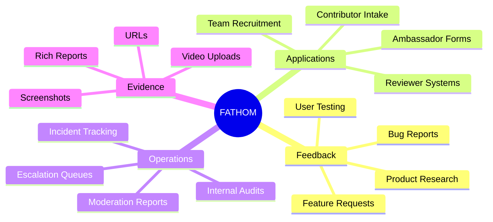
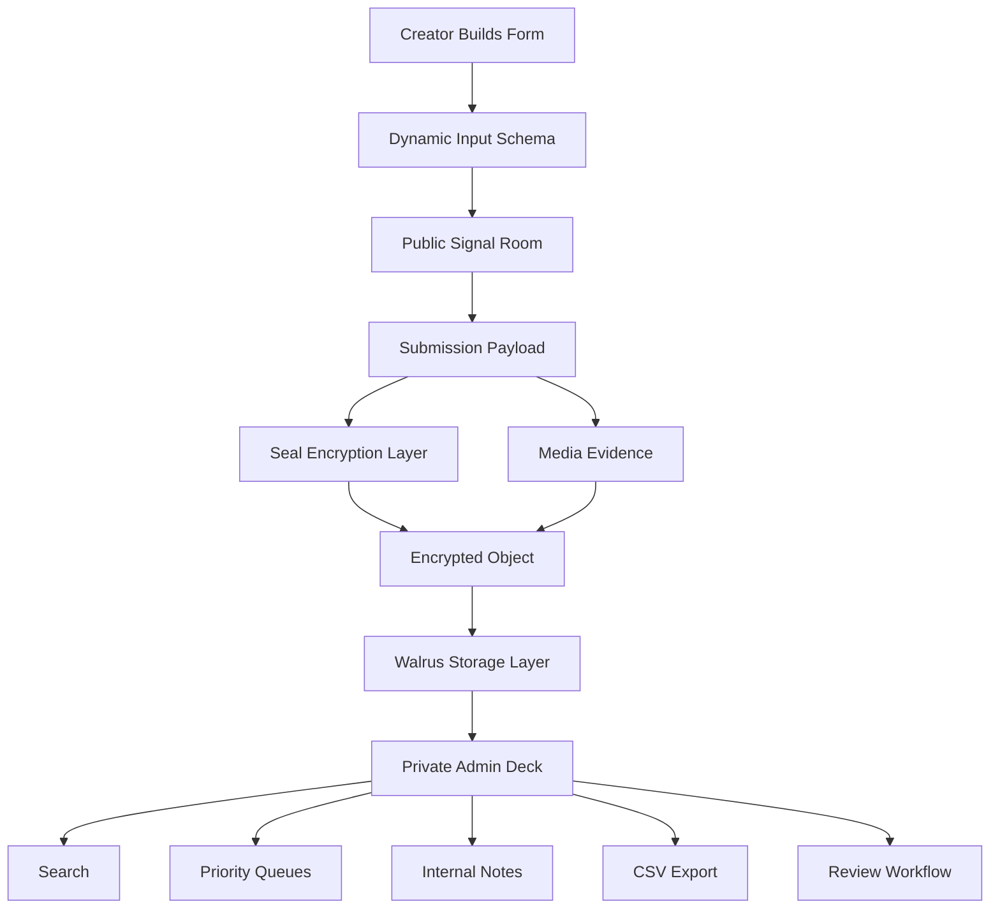
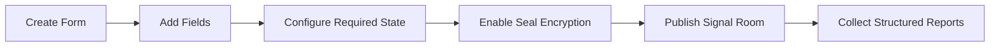
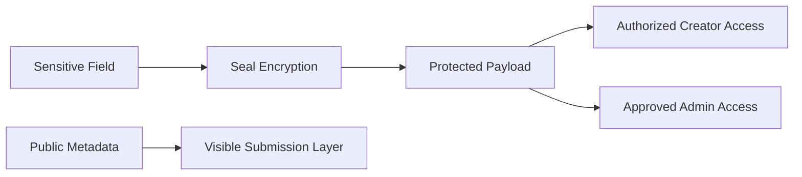
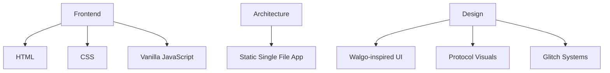
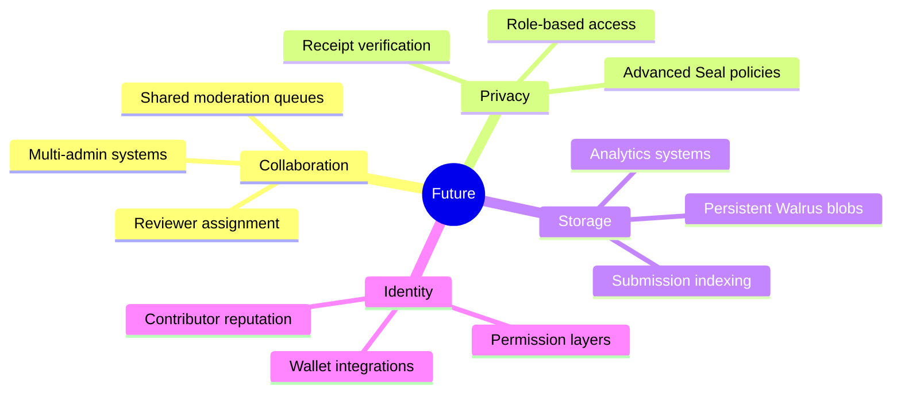

# FATHOM

<p align="center">
  
</p>

<p align="center">
  <b>Encrypted feedback infrastructure built for Walrus.</b>
</p>

<p align="center">
  Structured submissions. Media evidence. Seal-protected workflows. Operational signal rooms.
</p>

<p align="center">
  <b>Live on the web:</b> <a href="https://sandwich.wal.app">sandwich.wal.app</a>
</p>

---

# OVERVIEW

FATHOM is a Walrus-native submission and feedback operating system built for modern decentralized teams.

It transforms traditional forms into encrypted operational pipelines where reports, applications, media evidence, surveys, and internal workflows become structured Walrus-ready signal objects.

Instead of static SaaS forms, FATHOM introduces:

► dynamic form generation  
► encrypted submission layers  
► media-rich evidence intake  
► private admin review systems  
► searchable operational queues  
► Seal visibility states  
► Walrus-oriented storage architecture  

---

#WHAT FATHOM IS BUILT FOR



---

# SYSTEM ARCHITECTURE



---

# PLATFORM CAPABILITIES

| Layer | Capability |
|---|---|
| ► Builder | Dynamic form generation |
| ► Inputs | Rich text, dropdowns, ratings, uploads, URLs |
| ► Privacy | Seal-protected encrypted fields |
| ► Media | Screenshot + video evidence handling |
| ► Storage | Walrus-oriented object structure |
| ► Admin | Internal triage workflows |
| ► Export | CSV review exports |
| ► UX | Glitch-driven cyber interface system |
| ► Themes | Adaptive dark/light rendering |
| ► Search | Real-time submission filtering |

---

# INPUT SYSTEM

FATHOM supports operational-grade submission payloads.

```text
► Rich Text        → Long-form signal reports
► Dropdowns        → Structured classification
► Checkboxes       → Multi-surface tagging
► Ratings          → Severity + quality scoring
► Screenshots      → Visual evidence uploads
► Video Uploads    → Walkthrough proof
► URLs             → Reference linking
► Confirmation     → Explicit submission consent
```

---

# FORM CREATION FLOW



---

# ADMIN REVIEW SYSTEM

FATHOM includes a private operational dashboard for triaging submissions.

### Queue States

```text
► NEW        → Unreviewed submissions
► REVIEW     → Needs reviewer attention
► ACTION     → Ready for escalation/export
```

### Admin Controls

► Search submissions instantly  
► Sort by priority or evidence type  
► Attach internal reviewer notes  
► Export operational CSV reports  
► Track encrypted Seal payloads  
► Monitor media evidence status  
► Filter submissions dynamically  

---

# ENCRYPTION MODEL



---

# VISUAL SYSTEM

FATHOM uses a high-contrast protocol aesthetic inspired by Walgo/Walrus environments.

### Interface DNA

► Pixel typography  
► Scanline overlays  
► Terminal panels  
► Floating protocol grids  
► Glitch animations  
► Magnetic interactions  
► Retro-futurist UI systems  
► Cyberpunk operational styling  

---

# TECH STACK



---

# REPOSITORY STRUCTURE

```text
.
├── index.html
└── README.md
```

---

# DEPLOYMENT MODEL

FATHOM is designed for static deployment environments.

Compatible with:

► Walrus-native hosting flows  
► Static web infrastructure  
► Decentralized frontend hosting  
► Traditional hosting providers  

---

# FUTURE EXTENSIONS



---

# DESIGN PHILOSOPHY

FATHOM is designed around one idea:

> feedback should behave like operational infrastructure, not disposable form data.

Every report becomes:

► structured  
► searchable  
► reviewable  
► exportable  
► encryptable  
► media-aware  
► workflow-ready  

---

#AUTHOR

Built by [Dexar](https://x.com/dexarxbt)

### Repository

[FATHOM-Walrus-Feedback-OS Repository](https://github.com/dexarxbt/FATHOM-Walrus-Feedback-OS)

---

<p align="center">
  
</p>
